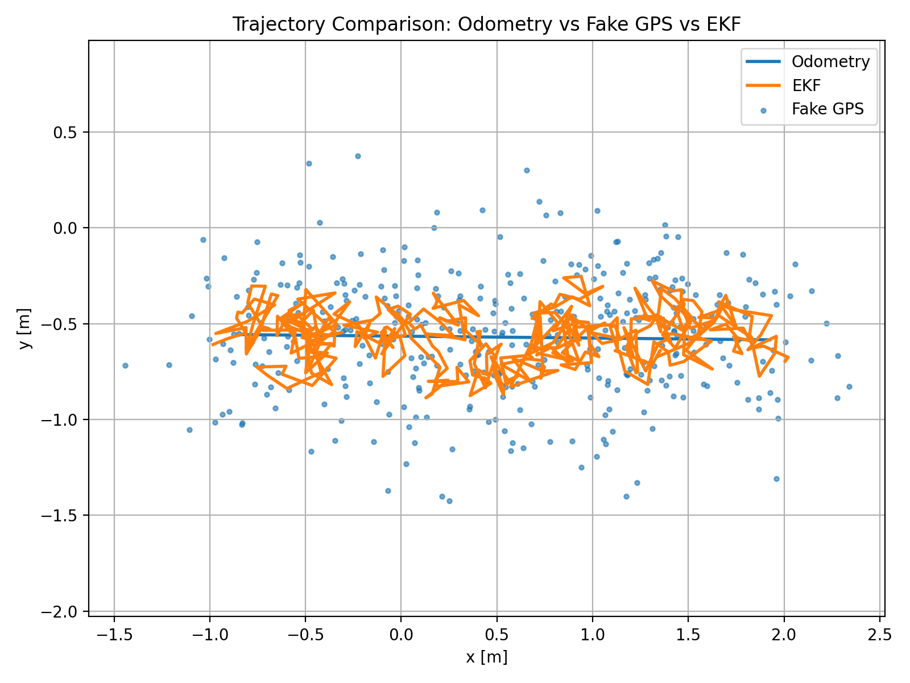

# ROS2 EKF Localization (C++)

A ROS2-based implementation of **Extended Kalman Filter (EKF) localization** built from scratch in C++, following the formulation in *Probabilistic Robotics*.  
The system performs real-time sensor fusion between odometry and simulated noisy GPS measurements in Gazebo.

---
## 📊 Results

### 🎥 Demo Video

A demonstration of the robot moving in a straight line while EKF localization runs in real-time.

<video src="results/line.mp4" width="600" controls></video>

---

### 📈 Trajectory Comparison



**Legend:**
- 🔵 Odometry: Smooth but prone to drift
- 🔴 Fake GPS: Noisy measurements
- 🟢 EKF: Fused estimate combining prediction and correction

---

### 🧠 Interpretation

- The fake GPS shows high variance due to simulated noise.
- Odometry provides smooth motion estimates but can accumulate error.
- The EKF combines both sources to produce a filtered trajectory.

In this straight-line experiment, the EKF tracks the motion while mitigating measurement noise, demonstrating effective sensor fusion.
---

## 📌 Overview

This project implements a full EKF pipeline for mobile robot localization:

- **Prediction** from wheel odometry (`/odom`)
- **Correction** from simulated noisy GPS (`/fake_gps`)
- **Fused estimate** published as `/ekf/odom`

The system is tested on a **TurtleBot3 in Gazebo**, demonstrating real-time state estimation under noisy conditions.

---

## 🧠 EKF Formulation

### Prediction
μ̄ₜ = g(uₜ, μₜ₋₁)  
Σ̄ₜ = Gₜ Σₜ₋₁ Gₜᵀ + Rₜ  

### Update
Kₜ = Σₜ Hₜᵀ (Hₜ Σₜ Hₜᵀ + Qₜ)⁻¹  
μₜ = μₜ + Kₜ(zₜ - ẑₜ)  

---

## 🏗️ System Architecture

```
       +----------------+
       |   /odom        |
       | (wheel data)   |
       +--------+-------+
                |
                v
           [Prediction]
                |
                v
           +---------+
           |   EKF   |
           +---------+
                ^
                |
           [Update]
                |
       +--------+--------+
       |   /fake_gps     |
       | (noisy sensor)  |
       +-----------------+

                |
                v
         /ekf/odom (output)
```
---

## 📂 Package Structure

```

ekf_localization_ros2/
├── include/
│   └── ekf_localization_ros2/
│       └── ekf.hpp
├── src/
│   ├── ekf.cpp
│   ├── ekf_node.cpp
│   └── fake_gps_node.cpp
├── CMakeLists.txt
└── package.xml

````

## ⚙️ Installation

### Prerequisites
- ROS2 Humble
- TurtleBot3 packages
- Gazebo

Install dependencies:

```bash
sudo apt install ros-humble-turtlebot3* ros-humble-gazebo-ros-pkgs
````

---

## 🚀 Build

```bash
cd ~/ekf
source /opt/ros/humble/setup.bash
colcon build
```

---

## ▶️ Run the system

### 1. Launch Gazebo

```bash
source /opt/ros/humble/setup.bash
export TURTLEBOT3_MODEL=burger
ros2 launch turtlebot3_gazebo turtlebot3_world.launch.py
```

---

### 2. Run Fake GPS node

```bash
source ~/ekf/install/setup.bash
ros2 run ekf_localization_ros2 fake_gps_node
```

---

### 3. Run EKF node

```bash
source ~/ekf/install/setup.bash
ros2 run ekf_localization_ros2 ekf_node
```

---

### 4. Teleoperate robot

```bash
source /opt/ros/humble/setup.bash
export TURTLEBOT3_MODEL=burger
ros2 run turtlebot3_teleop teleop_keyboard
```

---

## 📊 Monitoring Topics

### Raw Odometry

```bash
ros2 topic echo /odom --field pose.pose.position
```

### Noisy GPS

```bash
ros2 topic echo /fake_gps
```

### EKF Output

```bash
ros2 topic echo /ekf/odom --field pose.pose.position
```

---

## 🔍 Expected Behavior

| Topic       | Behavior             |
| ----------- | -------------------- |
| `/odom`     | smooth but may drift |
| `/fake_gps` | noisy, jittery       |
| `/ekf/odom` | smooth and corrected |

Example:

```
/odom       → smooth trajectory
/fake_gps   → noisy jumps
/ekf/odom   → filtered estimate (best of both)
```

---

## 🎯 Key Features

* EKF implemented from scratch (no external localization packages)
* Book-aligned notation (μ, Σ, R, Q)
* Modular ROS2 node architecture
* Simulated sensor noise for realistic testing
* Real-time operation in Gazebo

---

## 📈 Future Work

* RMSE evaluation against ground truth
* Comparison with `robot_localization`
* Sensor dropout handling
* Multi-sensor fusion (IMU, LiDAR)
* ROS2 Nav2 integration

---

## Key Insight

The EKF combines:

* **Odometry** → smooth but drifting
* **GPS** → noisy but unbiased
